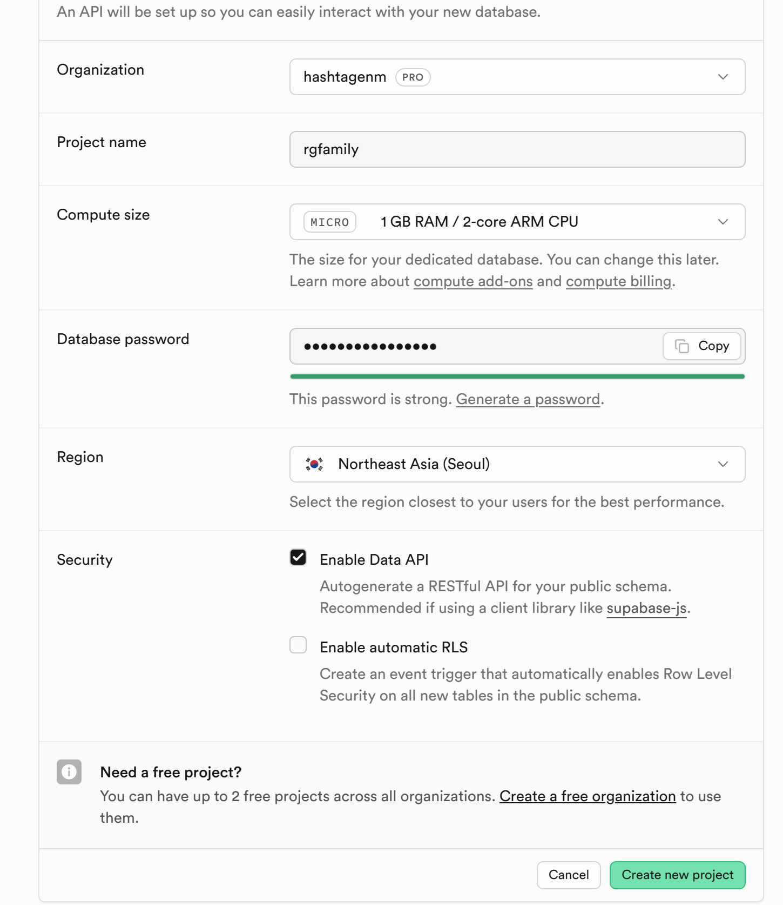
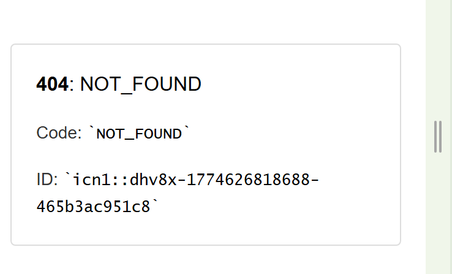
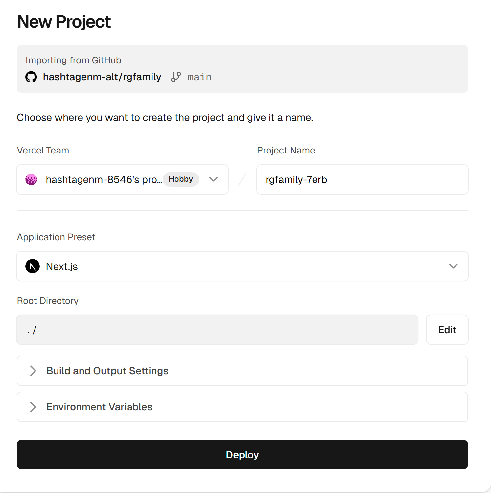
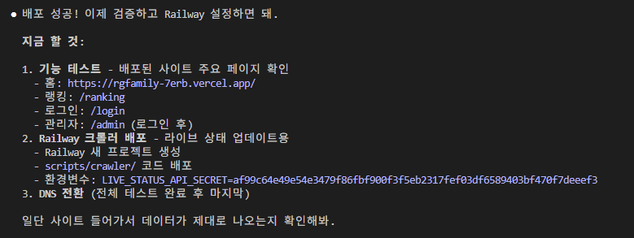
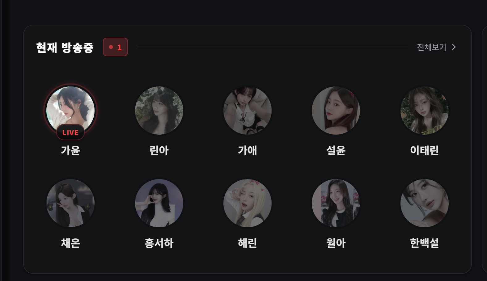
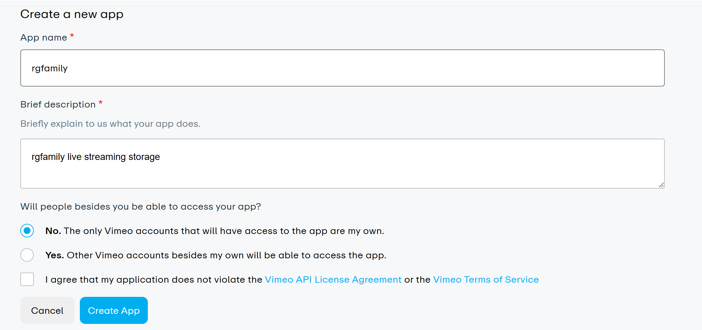

[클라우드 계정 마이그레이션 작업]
- 기존 외주 개발사 계정의 클라우드 서비스를 전면 고객사 서비스로 마이그레이션하고 운영 서버도 고객사 서비스로 전환
- 추가로 Vimeo로 영상 저장 및 스트리밍 서비스 마이그레이션

#1. [클라우드 계정 마이그레이션 작업]을 하는데 있어 업무 순서를 요약해줘. 이미 계정은 확보된 상태야.

#2. AI가 할 수 있는것

#3. 이제 하나씩 해보자. 그 다음 뭐하면 될까? github 으로 레포지토리 만들까?

#4. 
[github 주소]
https://github.com/hashtagenm-alt/rgfamily.git
[github 계정]
hashtagenm@gmail.com

#5. [supabase]
비번: 2VA8xZXiyC1CCYPE

이렇게 하면돼?

https://yrhilxqwryvavookoqxu.supabase.co
sb_publishable_mteANmU42_WRbNQKPh_Hdw_ljq9oPFr
sb_secret_AGAFkHk1AezPMg_5zglzHQ_1ogrhJ4l

#5-1. workthrough/20260325/migration_full_schema.sql 이게 현재 운영중인 DB 그대로 100% 복원 SQL이야?

> migration_full_schema.sql 완료함.

#6. 백업데이터 복원

ALTER TABLE public.profiles DROP CONSTRAINT profiles_id_fkey; 

> 결과  26개 테이블, 8,839건 전부 100% 일치!

#
아니 실제 이렇게 뜨면서 화면이 안나와

# 

다시 해볼게 이거 맞아?

# 2026.03.28 1:22am 배포 성공
https://rgfamily-7erb.vercel.app/rg/org

이제 남은것.

- [] Railway 크롤러 배포
- [] 테스트 완료 후 dns 전환
- [] vimeo 로 전환

# 
railway 있어!
어떻게 배포하면돼? 너가 직접 해줄래?

성공했어 근데 크롤러가 기존꺼랑 2개 도는데 기존 운영하는 도메인은 아직 안바꿨는데 영향있어?

지금 만든 크롤러가 제대로 동작하는건지 모르겠네..?      
 
실제 이게 업데이트가 안되었는데?

# 이제 Vimeo 로 먼저 바꿔야 할거 같은데?!

기존 데이터 전부 백업해서 말야.
전략을 세워줘. 너가 에이전트를 구분하여 활용해서 작업해야해.

이렇게 체크하면 돼?

복잡하네 어케 설정하니 토큰은? 자세히 알려줘

## 현재 클라우드플레어 스트리밍서비스에 있는 영상 용량은 얼마인지 알아?
그리고 이거를 전부 Vimeo 올리면 문제되지 않아?

# 영상 압축

ffmpeg을 통해 압축하면 얼마나 퀄이 떨어져?
Vimeo도 압축하면 그냥 80GB 올리면 안돼 ? 그럼 그건 그냥 80기가 짜리로 보는거야?

압축잘된거야? 어디있어 영상이?